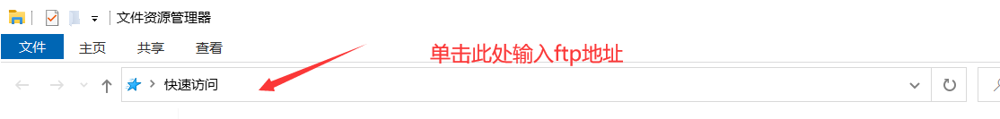
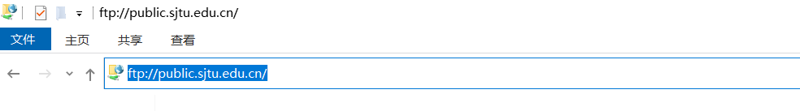
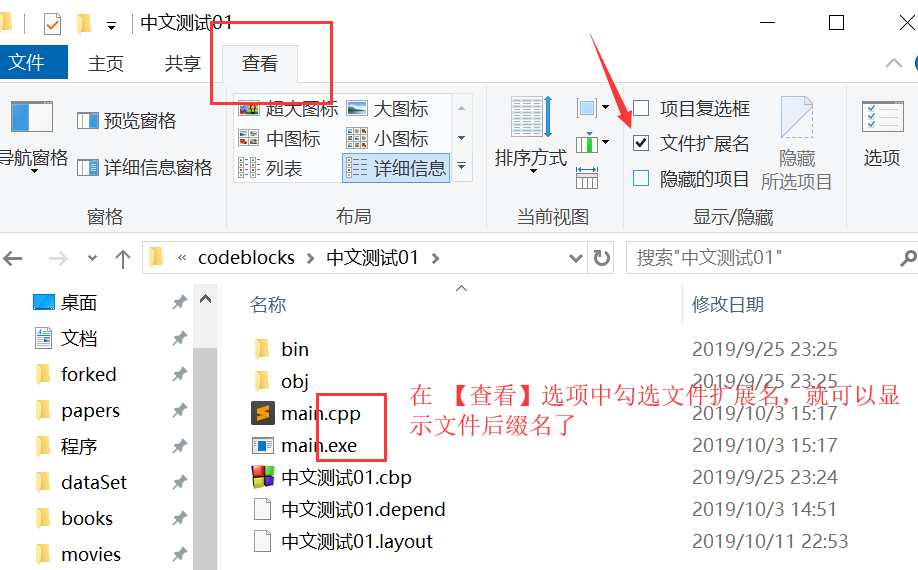

# SJTU-Awesome-TA-CPP
Common Problems Gathered from Students Learning Cpp.

## C++ 程序设计学习指导【不断更新】

> 遇到了任何问题都不要慌张，
> 1. 百度搜索你遇到的问题
> 2. 上机的时候向助教询问
> 3. 微信群里主动提问或者私聊助教询问询问 

- [C++ 程序设计学习指导【不断更新】](#c-程序设计学习指导不断更新)
  - [Tutorials](#tutorials)
      - [EduCoder相关问题汇总](#educoder相关问题汇总)
      - [CodeBlocks相关问题汇总](#codeblocks相关问题汇总)
      - [(Optional)在MacOS上使用VS Code配置C++环境](#optional在macos上使用vs-code配置c环境)
      - [C++编程问题汇总【不断更新】](#c编程问题汇总不断更新)
  - [Q & A](#q--a)
      - [1. 如何登陆 ftp](#1-如何登陆-ftp)
      - [2. 如何截图](#2-如何截图)
      - [3. 什么是文件的后缀名？](#3-什么是文件的后缀名)
      - [4. 有哪些常用的快捷键](#4-有哪些常用的快捷键)

## Tutorials

#### [EduCoder相关问题汇总](https://github.com/905355494/SJTU-Awesome-TA-CPP/blob/master/tutorials/EduCoder.md)

[点击此处跳转](https://github.com/905355494/SJTU-Awesome-TA-CPP/blob/master/tutorials/EduCoder.md)

#### [CodeBlocks相关问题汇总](https://github.com/905355494/SJTU-Awesome-TA-CPP/blob/master/tutorials/CodeBlocks.md)

[点击此处跳转](https://github.com/905355494/SJTU-Awesome-TA-CPP/blob/master/tutorials/CodeBlocks.md)

#### [(Optional)在MacOS上使用VS Code配置C++环境](https://code.visualstudio.com/docs/cpp/config-clang-mac)

[点击此处跳转](https://code.visualstudio.com/docs/cpp/config-clang-mac)

#### [C++编程问题汇总【不断更新】](https://github.com/905355494/SJTU-Awesome-TA-CPP/blob/master/tutorials/Cpp.md)

[点击此处跳转](https://github.com/905355494/SJTU-Awesome-TA-CPP/blob/master/tutorials/Cpp.md)

## Q & A 

#### 1. 如何登陆 ftp

电脑上输入 `win` + `e` 打开资源管理器(其中win键是一个形状像“田”的键)，然后在快速访问中输入ftp地址，例如 ftp://public.sjtu.edu.cn ，之后输入账号密码即可。一般不要勾选保存密码。

#### 2. 如何截图

学习截图快捷键可以让同学们更方便的截图询问助教问题。不提倡使用手机拍电脑屏幕的方式提问。

win10 上原生自带截图

- 快捷键 `Win Shift S` 
- 键盘上的 `PrtSc` 键

- 微信的 `Alt A` 
- Tim/QQ 的 `Ctrl Alt A`

#### 3. 什么是文件的后缀名？

> 什么是.cpp文件啊？我在文件管理器/我在Codeblocks工程里面没有看到有.cpp文件和.h文件啊，如何查看文件后缀名呢？

在文件资源管理器中，在【查看】选项中勾选文件扩展名，就可以显示文件后缀名了。

#### 4. 有哪些常用的快捷键

* `Ctrl S` ： 保存
* `Ctrl A` ： 全选
* `Ctrl C` ： 复制
* `Ctrl V` ： 粘贴
* `Ctrl Z` ： 撤销
* `Ctrl Y` ： 恢复
