# [CodeBlocks 相关问题汇总](https://github.com/OneForward/TACpp/blob/master/tutorials/CodeBlocks.md)

> 遇到了任何问题都不要慌张，
> 1. 上机的时候向助教询问
> 2. QQ群里主动提问或者私聊助教询问
> 3. 微信群里询问
> 4. 百度搜索你遇到的问题

本教程提供 CodeBlocks 【以版本20.03(Windows)为例】 的安装、汉化、使用以及其他问题的指导。

- [CodeBlocks 相关问题汇总](#codeblocks-相关问题汇总)
  - [下载 `codeblocks-20.03mingw-setup.exe`](#下载-codeblocks-2003mingw-setupexe)
  - [安装](#安装)
  - [第一次使用](#第一次使用)
    - [文件关联 CodeBlocks 的提示](#文件关联-codeblocks-的提示)
    - [新建一个C++项目](#新建一个c项目)
  - [CodeBlocks 如何进行简单的代码调试 / Debug ?](#codeblocks-如何进行简单的代码调试--debug-)
  - [汉化](#汉化)
    - [汉化包链接](#汉化包链接)
    - [解压汉化包](#解压汉化包)
    - [配置CodeBlocks](#配置codeblocks)
  - [Q & A](#q--a)
    - [1. 如何解决中文乱码问题](#1-如何解决中文乱码问题)
      - [设置文件编码格式](#设置文件编码格式)
      - [在编译命令中增加编码格式的设置](#在编译命令中增加编码格式的设置)
    - [2. 如何修改编译器类型](#2-如何修改编译器类型)
    - [3. 如何设置编译器路径](#3-如何设置编译器路径)
    - [4. 首页跳出的 `Tip of the Day` 是什么](#4-首页跳出的-tip-of-the-day-是什么)

## 下载 `codeblocks-20.03mingw-setup.exe` 

- [交大云盘下载链接](https://jbox.sjtu.edu.cn/l/71KbdW)
- 或者向助教索取。


## 安装

1. 双击安装包 `codeblocks-20.03mingw-setup.exe` 

2. 点击 `Next`, `I Agree`, `Next`, `Install`
   
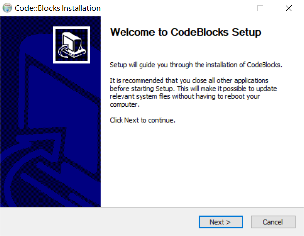

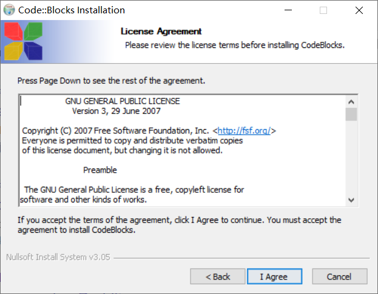

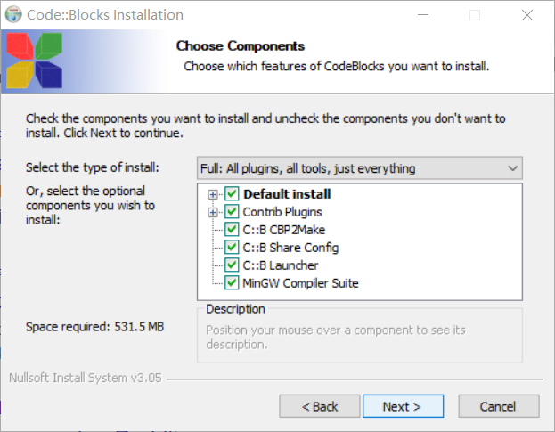

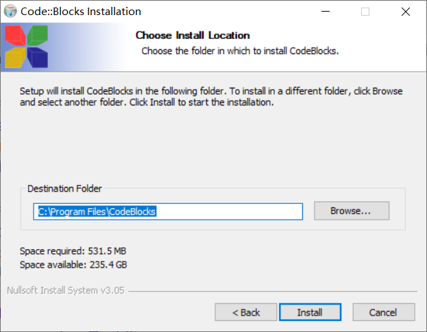

之后等待安装即可。

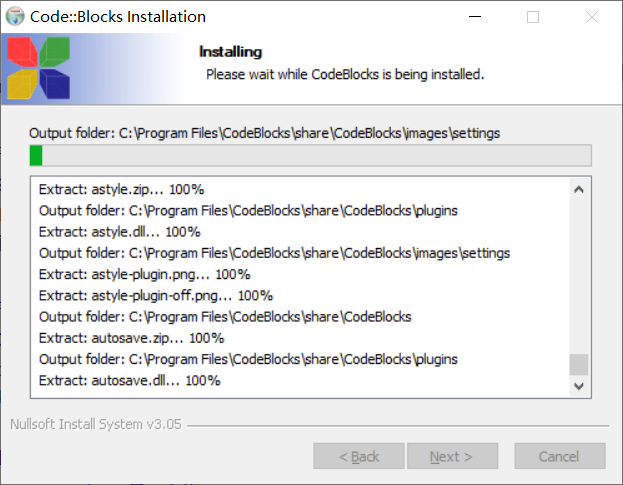

安装完成后后提示是否马上运行，这里可以直接运行，也可以不马上运行。

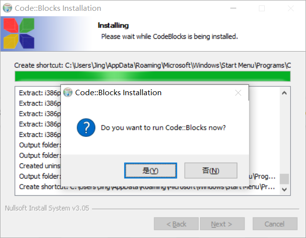

点击 `Next`, `Finish` 安装就结束啦。

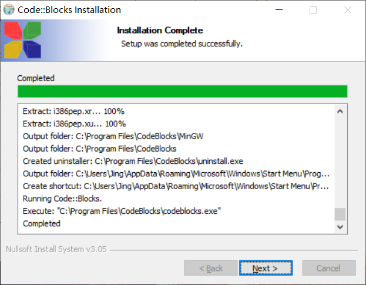

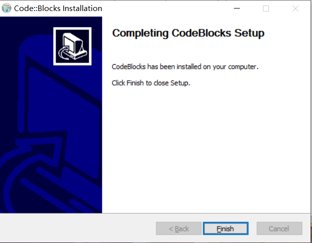

往后正常使用时，我们可以通过点击桌面的 CodeBlock 快捷键运行。如果启动遇到了问题，可以向助教询问。

## 第一次使用

### 文件关联 CodeBlocks 的提示
第一次使用可能会出现是否要进行 C++/C 源文件关联 CodeBlocks 的提示, 


建议初学者选择 **最后一项**，全部关联。对其他IDE更熟悉的同学则可以根据自己的需求选择。

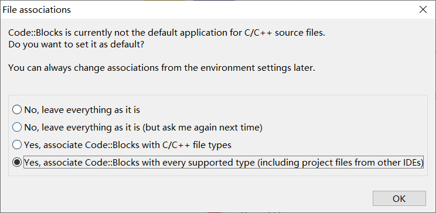

### 新建一个C++项目

现在，我们来新建一个 C++ 命令行项目，

1. 选择开始页面正中央的 `Create a new project`

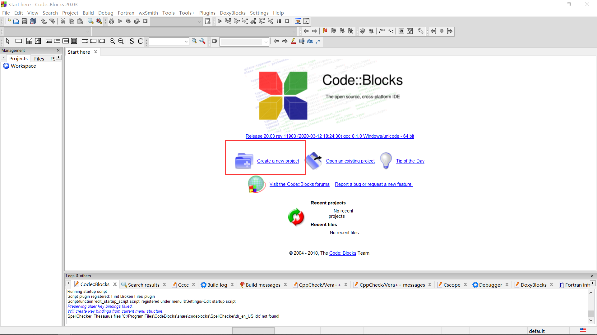

2. 选择 `Console application`, 然后点击 `Go`。我们要建立的是一个命令行项目。本学期的上机作业绝大部分都是命令行作业。

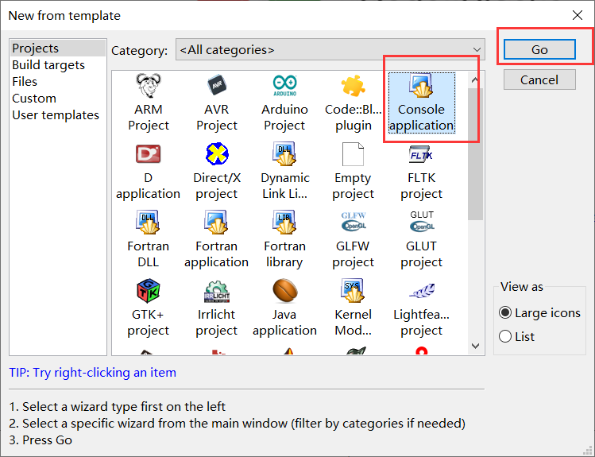

3. 选择 `Skip Next Time` 点击 `Next`。之后我们便可以跳过这一步。

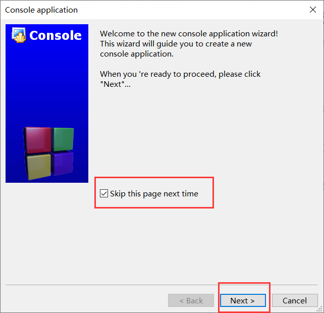

4. 选择 `C++` 项目，点击 `Next`

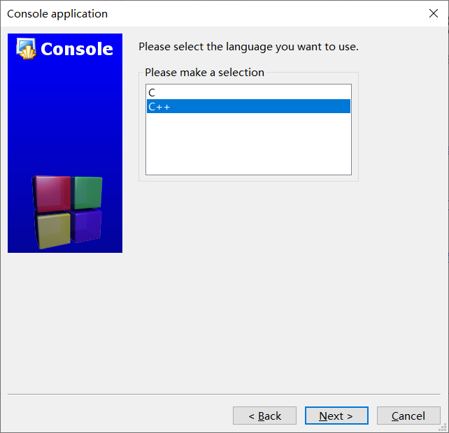

5. 设置项目的标题与保存位置。

项目标题自拟，保存路径也可以任意。

> 但是**建议标题与文件夹路径中都不含有中文和空格。**

建议设置一个专门的文件夹来存放所有的C++项目。

以下是一个例子，我选择了一个全英文的名称作为项目标题，我保存在一个没有空格和中文名称的路径中。


6. 项目设置完成了。点击 `Finish` 即可。

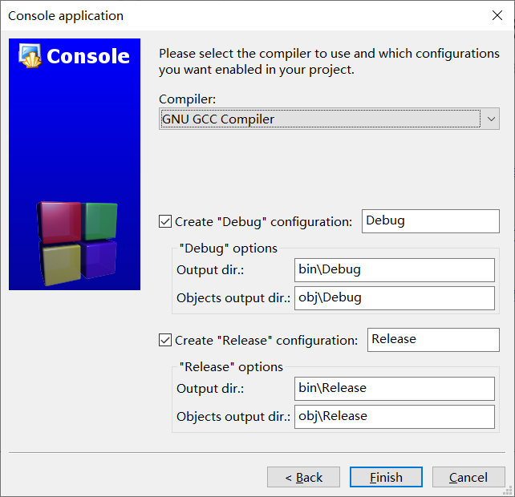

7. 在刚刚建好的项目下，点击 Sources 左侧的 + 号，然后双击 main.cpp 就可以看到待编辑的源代码啦。

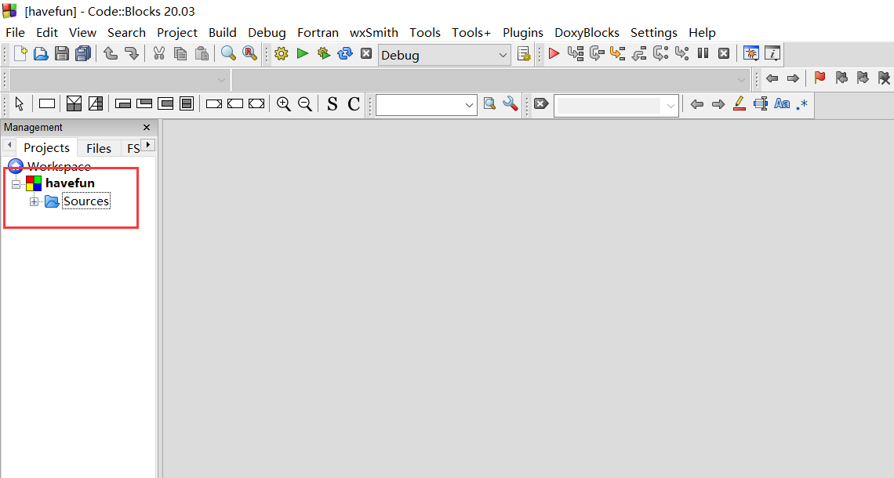

8. 选择这里的带有绿色三角形的小齿轮，含义是 Build and Run，也就是编译和运行，然后我们就可以看到黑色的命令行输出啦。大功告成。

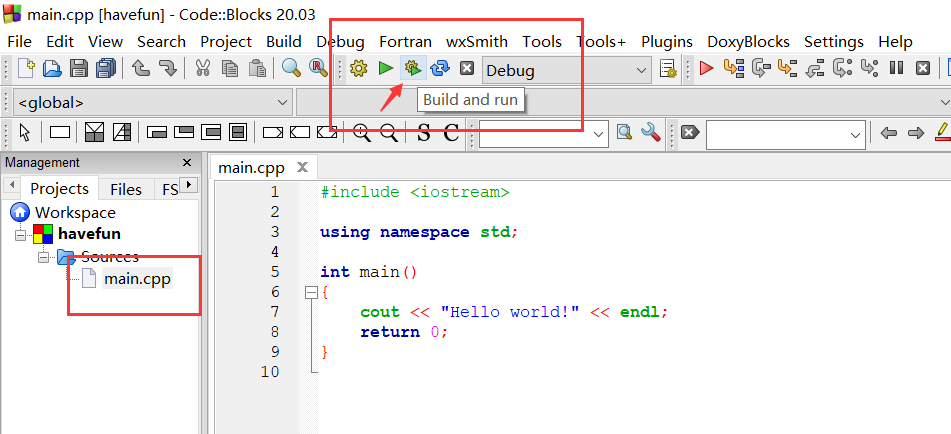

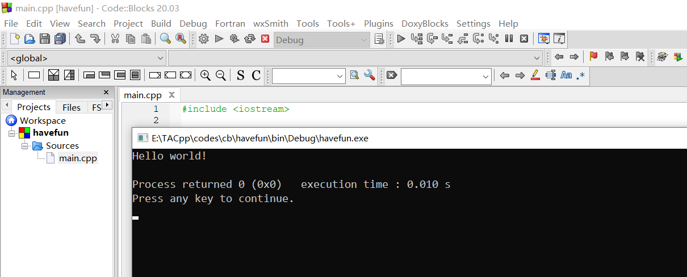

> 以后我们每一次作业，都可以按照上述 1-8 的步骤进行。步骤3 选择了 Skip 之后以后可以跳过。新建项目遇到了任何问题都请及时向助教询问。

## CodeBlocks 如何进行简单的代码调试 / Debug ?

Debug 的功能：

1. 提供运行时的中断处的局部变量和全局变量值
2. 在运行时，观察中断处指定表达式的值

这一节适合同学们在对编写C++代码较为熟悉之后学习。

对于如下一段简单的代码，我们提供一份简单的代码调试指导。

```cpp
#include <iostream>

using namespace std;

int sumCubic(int n) {
    // 计算 1^3 + 2^3 + ... + n^3
    int sum = 0;
    while (n) {
        sum += n * n * n;
        n--;
    }
    return sum;
}

int main()
{
    for (int n = 0; n <= 10; ++n) {
        cout << "sumSquare(" << n << ") = " << sumCubic(n) << endl;
    }

    return 0;
}
```

将代码拷贝到你的项目里面（你可以新建一个项目，然后替换掉 main.cpp 里面的内容）

然后如图，鼠标单击行号即可设置中断点，打开**红色小三角形**开启调试。

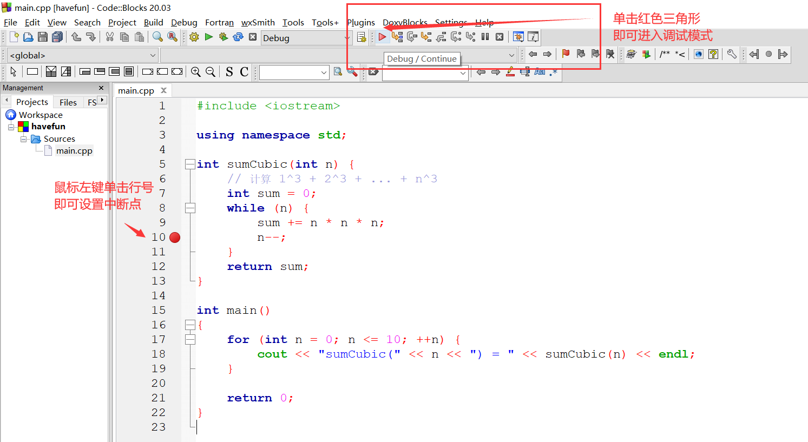

如图，你会看到一个黄标运行到断点处。如图找到 蜘蛛形状的 Debugging Windows 选项，开启 `Watches`，然后便可以看到函数的局部变量的值了。

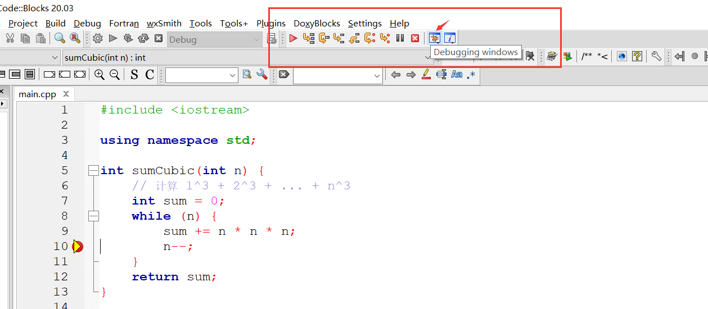

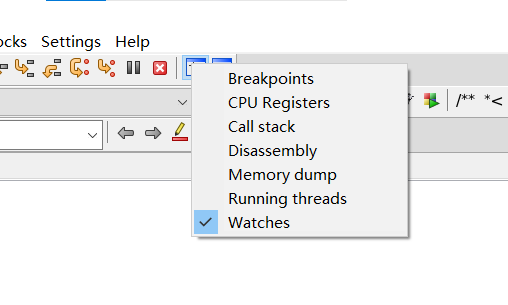

你也可以输入表达式，观察断点处表达式的值。

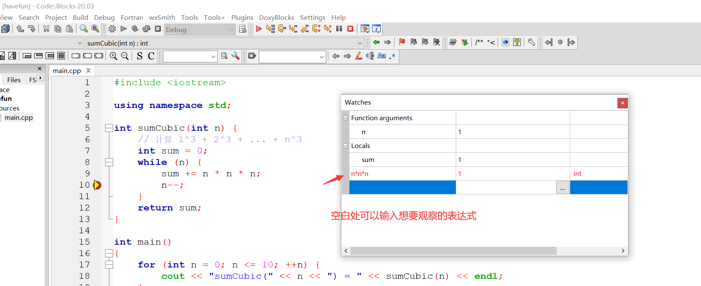

最后，可以点击红色的 X 退出 Debug。

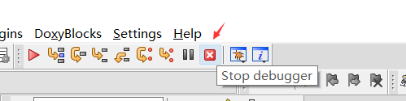

## 汉化

### 汉化包链接

[交大云盘](https://jbox.sjtu.edu.cn/l/Ou6oNv)

汉化包是一个名为 `locale.zip` 的压缩包

### 解压汉化包

首先找到你们的 `CodeBlocks` 的安装位置，点进 `share` 文件夹

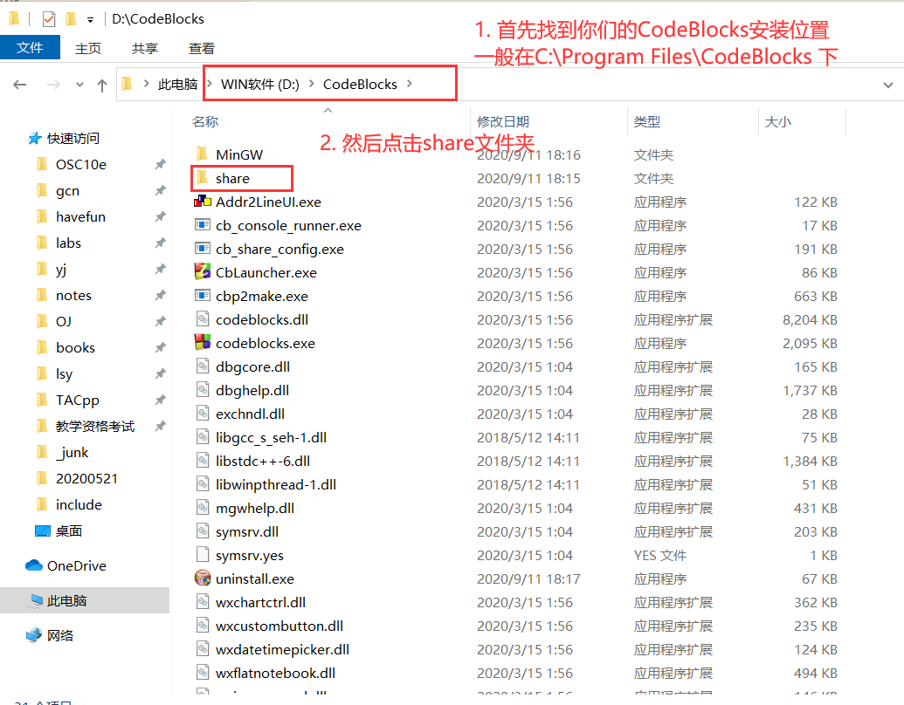

然后点进 `CodeBlocks` 文件夹

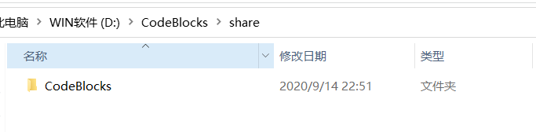

在当前这个文件夹下解压汉化包

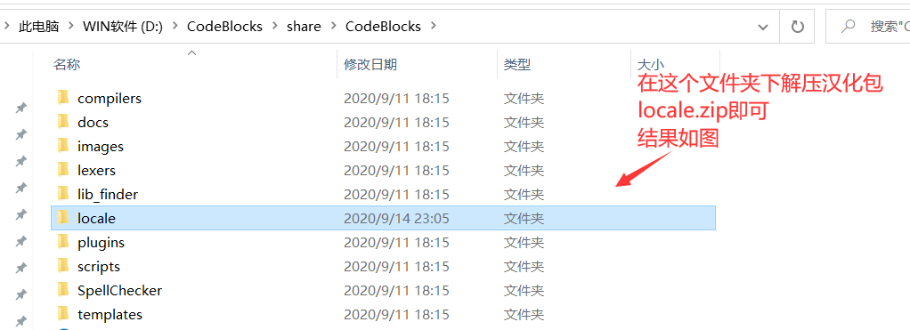

最终的汉化文件的位置应该如图所示，即 `locale\zh_CN\zh_CN.mo`

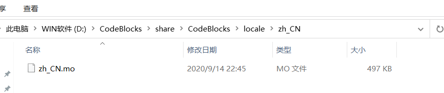

### 配置CodeBlocks

* 打开 CodeBlocks, 点击 Settings->Environment

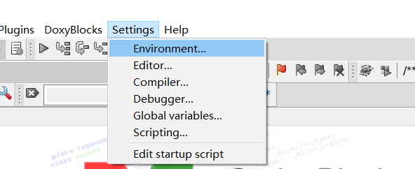

* 点击 View

* 勾选 Internationalization

* 右侧下拉选择 Chinese(Simplified)

* 点击 OK 即可

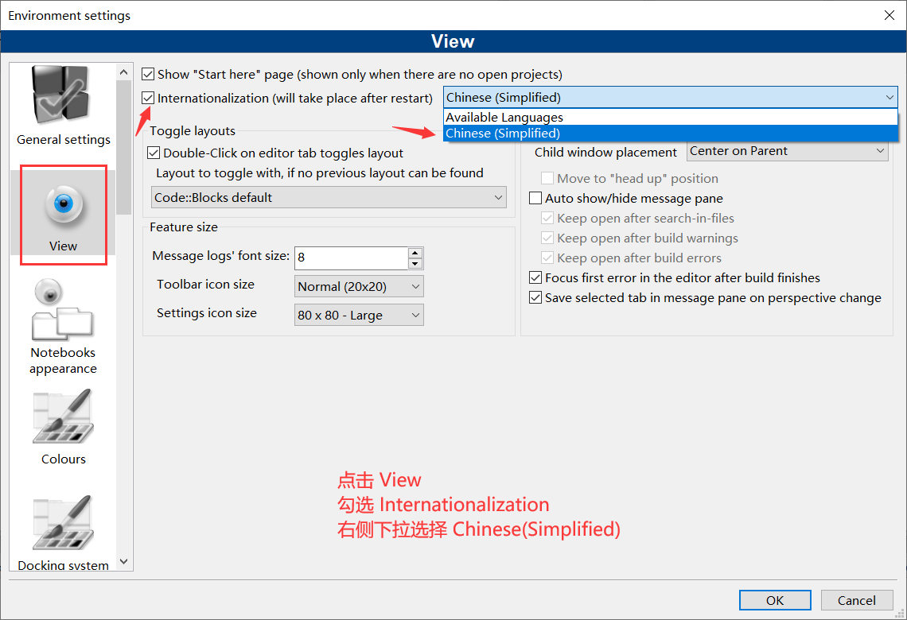

* 重启 CodeBlocks 即可看到汉化效果

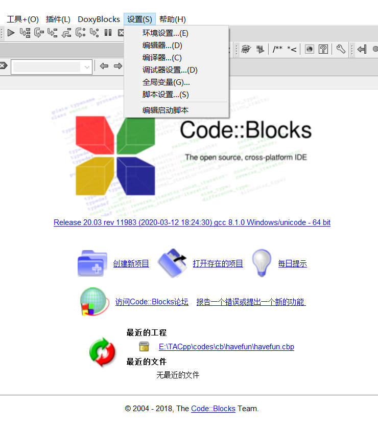


## Q & A

### 1. 如何解决中文乱码问题

建议阅读孟老师提供的文档。[交大云盘链接](https://jbox.sjtu.edu.cn/l/toTO8T)

或者按照如下步骤进行修改，如果仍然失败请咨询助教。

#### 设置文件编码格式

* 设置 -> 编辑器

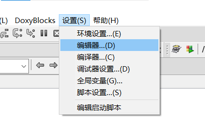

* 设置文件格式默认为 UTF-8

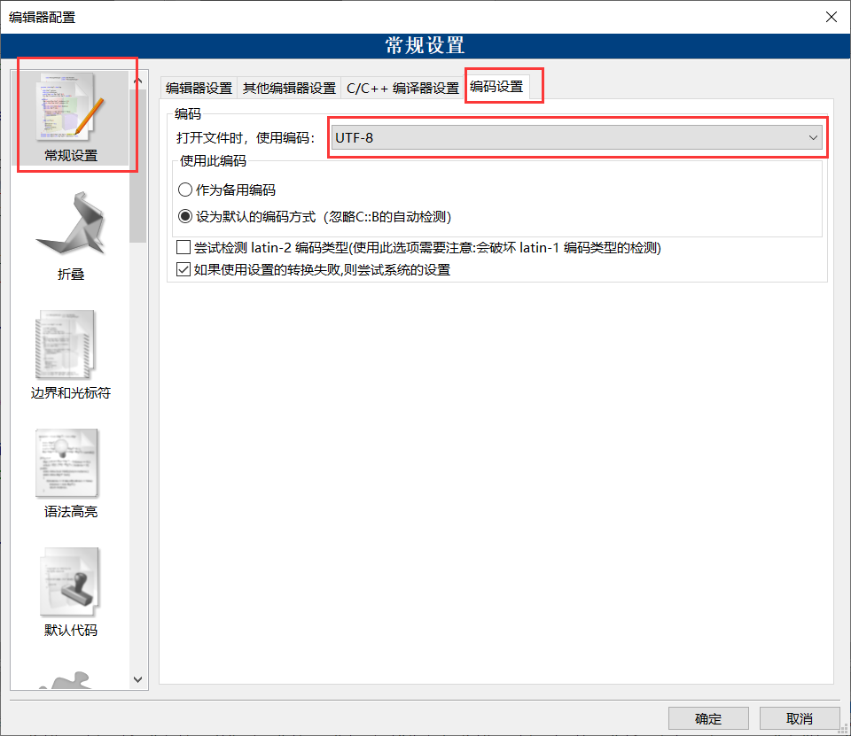

#### 在编译命令中增加编码格式的设置

* 设置 -> 编译器

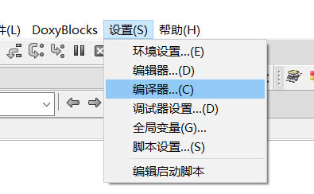

* 在图中位置添加编码命令，请在以下2种可能的命令中依次尝试

```sh
-fexec-charset=gbk
```

```sh
-finput-charset=gbk -fexec-charset=gbk
```

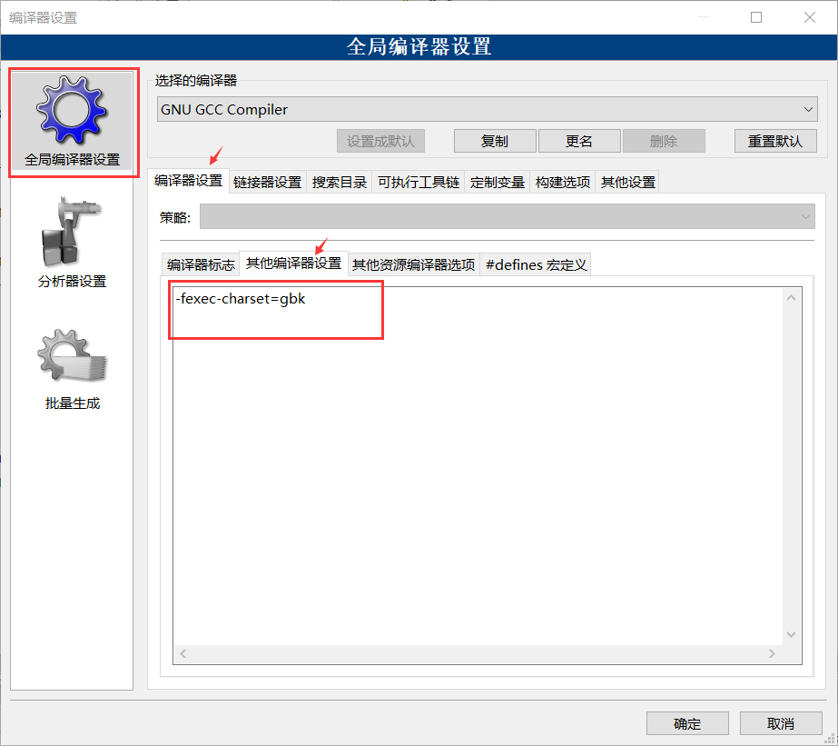


### 2. 如何修改编译器类型

* Settings-›Compiler


* 在 global compiler settings下，Selected Compiler选择GNU GCC Compiler，然后点击Set as default
  
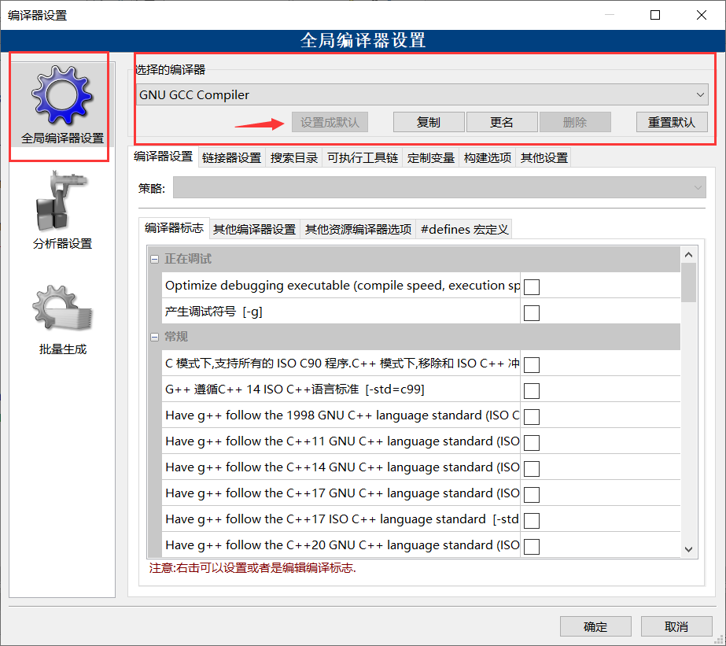

### 3. 如何设置编译器路径

* Settings-›Compiler


* 在 global compiler settings下，executable toolchain 下设置你的编译器的安装目录
  
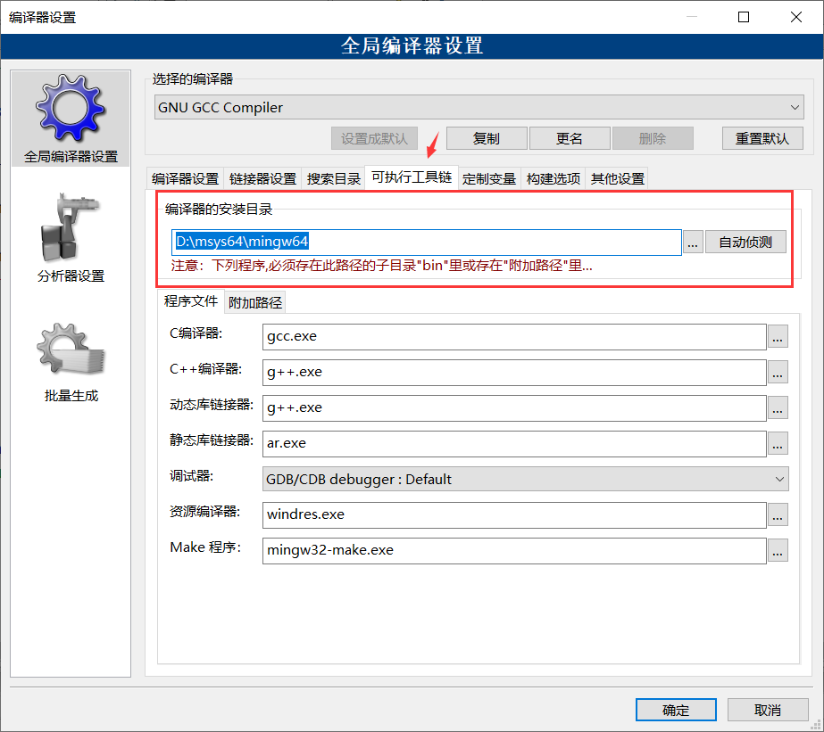

### 4. 首页跳出的 `Tip of the Day` 是什么

每日小贴士，不用管。如果以后不想看到请去掉底下勾选。