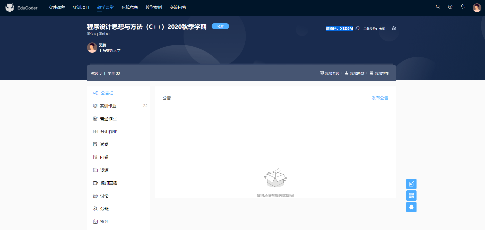

# [EduCoder相关问题汇总【待更新】](https://github.com/OneForward/TACpp/blob/master/tutorials/EduCoder.md)

- [EduCoder相关问题汇总【待更新】](#educoder相关问题汇总待更新)
  - [官网](#官网)
  - [注册](#注册)
  - [加入班级](#加入班级)
  - [实训作业](#实训作业)

## 官网 
EduCoder 官网链接为 https://www.educoder.net

[点击此处跳转 ](https://www.educoder.net)

## 注册

点击右上角的注册，然后请按照页面提醒完成注册流程。你可以选择手机号或者邮箱注册。

## 加入班级

 

输入课堂邀请码

* 课号为 CS171 的同学请输入邀请码 `GHX9U`
* 课号为 CS1581H(人工智能班) 的同学请输入邀请码 `LM5RK`

## 实训作业

助教确认你的加入邀请之后你就成功进入课堂啦。接下来就可以正常进行 educoder 上的实训作业了。

